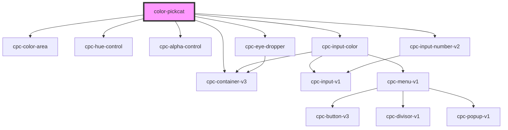

# color-pickcat

<!-- Auto Generated Below -->

## Properties

| Property      | Attribute    | Description | Type     | Default                        |
| ------------- | ------------ | ----------- | -------- | ------------------------------ |
| `colorArea`   | `color-area` |             | `string` | `this.getColorArea('#a200ff')` |
| `colorMarker` | `color`      |             | `string` | `'#703493'`                    |

## Events

| Event   | Description | Type                      |
| ------- | ----------- | ------------------------- |
| `color` |             | `CustomEvent<ColorEvent>` |

## Dependencies

### Depends on

- [cpc-color-area](../cpc-color-area)
- [cpc-hue-control](../cpc-hue-control)
- [cpc-alpha-control](../cpc-alpha-control)
- [cpc-input-color](../cpc-input-color)
- [cpc-eye-dropper](../cpc-eye-dropper)
- [cpc-container-v3](../cpc-container-v3)
- [cpc-input-number-v2](../cpc-input-number-v2)

### Graph

----------------------------------------------

*Built with [StencilJS](https://stenciljs.com/)*
