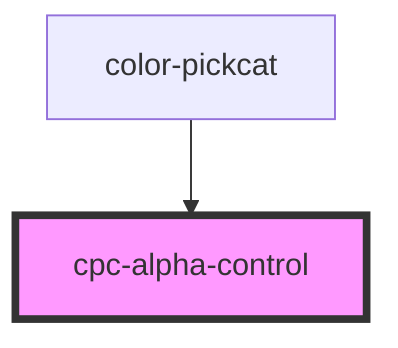

# cpc-alpha-control

<!-- Auto Generated Below -->

## Properties

| Property | Attribute | Description | Type     | Default     |
| -------- | --------- | ----------- | -------- | ----------- |
| `alpha`  | `alpha`   |             | `number` | `100`       |
| `color`  | `color`   |             | `string` | `'#FFFFFF'` |

## Events

| Event        | Description | Type                      |
| ------------ | ----------- | ------------------------- |
| `alphaValue` |             | `CustomEvent<AlphaEvent>` |

## Dependencies

### Used by

 - [color-pickcat](../color-pickcat)

### Graph

----------------------------------------------

*Built with [StencilJS](https://stenciljs.com/)*
