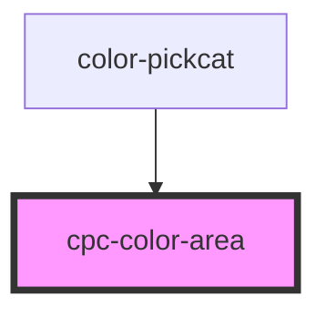

# cpc-color-area

<!-- Auto Generated Below -->

## Properties

| Property        | Attribute        | Description | Type                        | Default     |
| --------------- | ---------------- | ----------- | --------------------------- | ----------- |
| `alphaValue`    | `alpha-value`    |             | `number`                    | `100`       |
| `colorArea`     | `color-area`     |             | `string`                    | `'#FF0000'` |
| `colorMarker`   | `color-marker`   |             | `string`                    | `'#FFFFFF'` |
| `handlerPos`    | --               |             | `{ x: number; y: number; }` | `undefined` |
| `handlerRadius` | `handler-radius` |             | `number`                    | `0`         |

## Events

| Event             | Description | Type                                                         |
| ----------------- | ----------- | ------------------------------------------------------------ |
| `loadedComponent` |             | `CustomEvent<{ selectedColorDetail: SelectedColorDetail; }>` |
| `selectedColor`   |             | `CustomEvent<SelectedColorDetail>`                           |

## Dependencies

### Used by

 - [color-pickcat](../color-pickcat)

### Graph

----------------------------------------------

*Built with [StencilJS](https://stenciljs.com/)*
