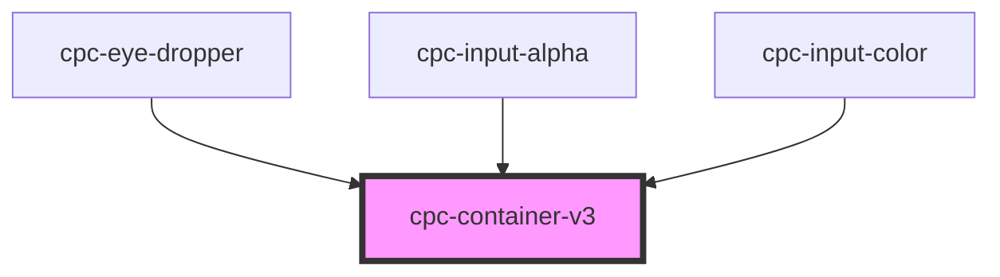

# cpc-container-v3

<!-- Auto Generated Below -->

## Properties

| Property | Attribute | Description | Type      | Default |
| -------- | --------- | ----------- | --------- | ------- |
| `active` | `active`  |             | `boolean` | `false` |

## Events

| Event          | Description | Type                               |
| -------------- | ----------- | ---------------------------------- |
| `restoreState` |             | `CustomEvent<{ state: boolean; }>` |

## Dependencies

### Used by

 - [cpc-eye-dropper](../cpc-eye-dropper)
 - [cpc-input-alpha](../cpc-input-alpha)
 - [cpc-input-color](../cpc-input-color)

### Graph

----------------------------------------------

*Built with [StencilJS](https://stenciljs.com/)*
