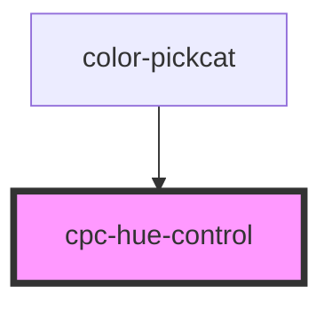

# cpc-hue-control

<!-- Auto Generated Below -->

## Properties

| Property | Attribute | Description | Type     | Default |
| -------- | --------- | ----------- | -------- | ------- |
| `value`  | `value`   |             | `number` | `0`     |

## Events

| Event      | Description | Type                    |
| ---------- | ----------- | ----------------------- |
| `hueValue` |             | `CustomEvent<HueEvent>` |

## Dependencies

### Used by

 - [color-pickcat](../color-pickcat)

### Graph

----------------------------------------------

*Built with [StencilJS](https://stenciljs.com/)*
