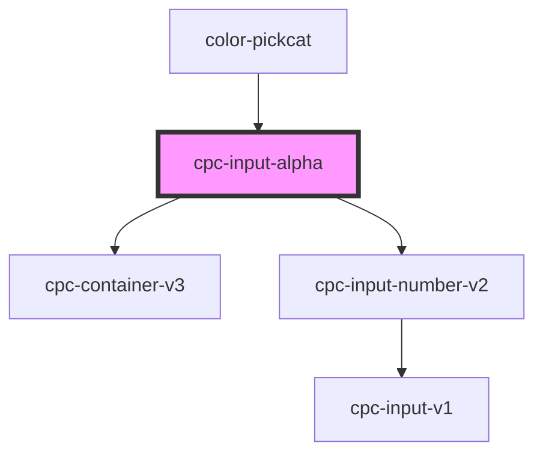

# cpc-input-alpha

<!-- Auto Generated Below -->

## Properties

| Property | Attribute | Description | Type     | Default |
| -------- | --------- | ----------- | -------- | ------- |
| `value`  | `value`   |             | `number` | `100`   |

## Events

| Event              | Description | Type                           |
| ------------------ | ----------- | ------------------------------ |
| `alphaValue`       |             | `CustomEvent<AlphaValueEvent>` |
| `inputAlphaChange` |             | `CustomEvent<InputEvent>`      |

## Dependencies

### Used by

 - [color-pickcat](../color-pickcat)

### Depends on

- [cpc-container-v3](../cpc-container-v3)
- [cpc-input-number-v2](../cpc-input-number-v2)

### Graph

----------------------------------------------

*Built with [StencilJS](https://stenciljs.com/)*
