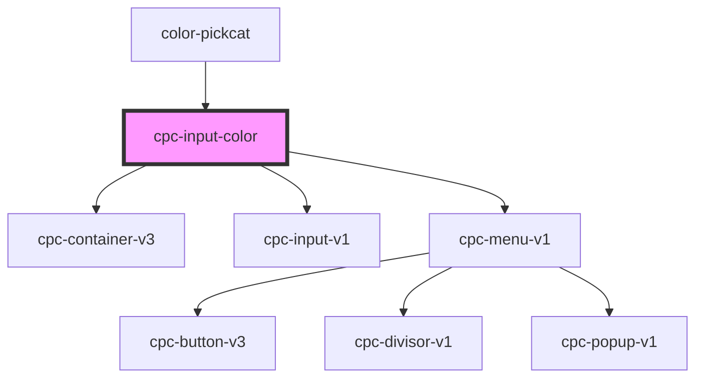

# cpc-input-color

<!-- Auto Generated Below -->

## Properties

| Property | Attribute | Description | Type       | Default     |
| -------- | --------- | ----------- | ---------- | ----------- |
| `colors` | --        |             | `string[]` | `[]`        |
| `value`  | `value`   |             | `string`   | `'#FFFFFF'` |

## Events

| Event           | Description | Type                                     |
| --------------- | ----------- | ---------------------------------------- |
| `inputChange`   |             | `CustomEvent<InputEvent>`                |
| `selectedColor` |             | `CustomEvent<{ currentColor: string; }>` |

## Dependencies

### Used by

 - [color-pickcat](../color-pickcat)

### Depends on

- [cpc-container-v3](../cpc-container-v3)
- [cpc-input-v1](../cpc-input-v1)
- [cpc-menu-v1](../cpc-menu-v1)

### Graph

----------------------------------------------

*Built with [StencilJS](https://stenciljs.com/)*
