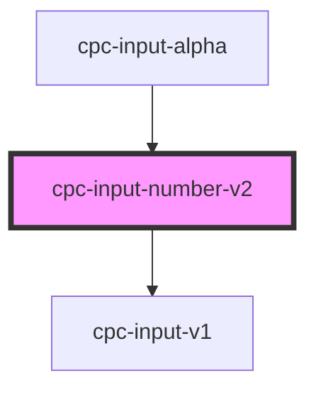

# cpc-input-number-v2

<!-- Auto Generated Below -->

## Properties

| Property | Attribute | Description | Type               | Default     |
| -------- | --------- | ----------- | ------------------ | ----------- |
| `label`  | `label`   |             | `string`           | `undefined` |
| `value`  | `value`   |             | `number \| string` | `0`         |

## Events

| Event            | Description | Type                              |
| ---------------- | ----------- | --------------------------------- |
| `cleanSelection` |             | `CustomEvent<InputEvent>`         |
| `decrement`      |             | `CustomEvent<{ value: number; }>` |
| `increment`      |             | `CustomEvent<{ value: number; }>` |
| `inputChange`    |             | `CustomEvent<InputEvent>`         |

## Dependencies

### Used by

 - [cpc-input-alpha](../cpc-input-alpha)

### Depends on

- [cpc-input-v1](../cpc-input-v1)

### Graph

----------------------------------------------

*Built with [StencilJS](https://stenciljs.com/)*
