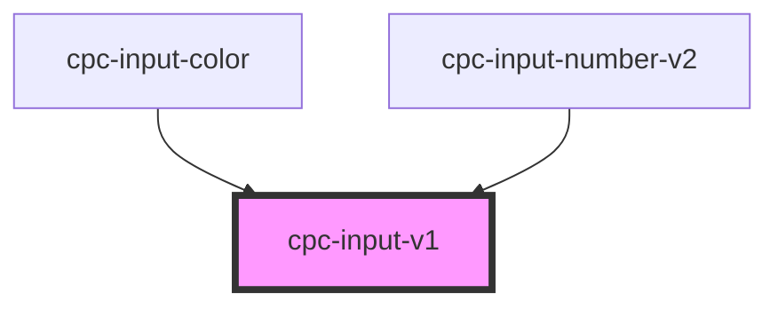

# cpc-input-v1

<!-- Auto Generated Below -->

## Properties

| Property      | Attribute     | Description | Type               | Default     |
| ------------- | ------------- | ----------- | ------------------ | ----------- |
| `placeholder` | `placeholder` |             | `string`           | `undefined` |
| `selection`   | `selection`   |             | `boolean`          | `false`     |
| `value`       | `value`       |             | `number \| string` | `undefined` |

## Events

| Event                 | Description | Type                      |
| --------------------- | ----------- | ------------------------- |
| `inputChange`         |             | `CustomEvent<InputEvent>` |
| `inputCleanSelection` |             | `CustomEvent<InputEvent>` |
| `inputSelection`      |             | `CustomEvent<InputEvent>` |

## Dependencies

### Used by

 - [cpc-input-color](../cpc-input-color)
 - [cpc-input-number-v2](../cpc-input-number-v2)

### Graph

----------------------------------------------

*Built with [StencilJS](https://stenciljs.com/)*
