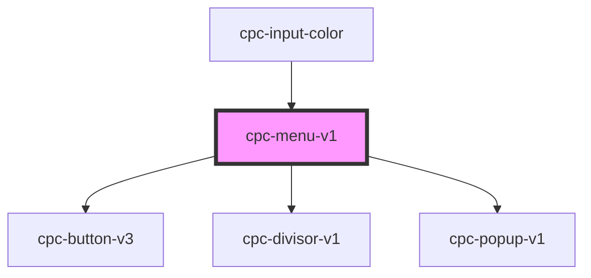

# cpc-menu-v1

<!-- Auto Generated Below -->

## Properties

| Property   | Attribute   | Description | Type               | Default     |
| ---------- | ----------- | ----------- | ------------------ | ----------- |
| `data`     | --          |             | `CpcMenuV1Props[]` | `undefined` |
| `openMenu` | `open-menu` |             | `boolean`          | `false`     |

## Events

| Event   | Description | Type                            |
| ------- | ----------- | ------------------------------- |
| `hover` |             | `CustomEvent<CpcMenuV1Props[]>` |
| `item`  |             | `CustomEvent<CpcMenuV1Item>`    |

## Dependencies

### Used by

 - [cpc-input-color](../cpc-input-color)

### Depends on

- [cpc-button-v3](../cpc-button-v3)
- [cpc-divisor-v1](../cpc-divisor-v1)
- [cpc-popup-v1](../cpc-popup-v1)

### Graph

----------------------------------------------

*Built with [StencilJS](https://stenciljs.com/)*
